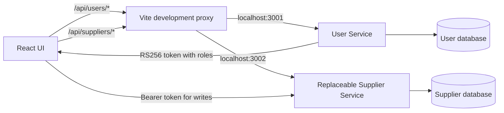

# Supplier Service replacement handoff

The UI supports the weekly-hours write contract from the teammate's README supplied on 7 October 2026. Her source code is not yet installed or tested here. The existing supplier implementation remains usable in `legacy` mode; no parallel implementation of her database or migrations has been created.

## Integration boundary



The browser uses HTTP only. `ui/api/suppliers.ts` owns paths, request bodies and normalization; it imports nothing from `supplier-service/`. UI assets remain in `data/images/`. The service owns its database and migrations. Vite is a development proxy, not a production gateway; production must proxy the same API prefixes.

## Switch after the PR is merged

1. Review and merge the teammate's Supplier Service code. Preserve the existing database volume and back it up before applying her migrations. Init scripts run only on an empty volume: a rebuild will not migrate the existing database. Obtain the exact incremental migration procedure from her PR. Do not use `docker compose down -v` to perform this upgrade.
2. Keep User Service on host port 3001 and publish Supplier Service on host port 3002 (container port 3001). Her standalone README uses host 3001, which conflicts with User Service. In her Compose app configuration retain `ports: ["3002:3001"]`.
3. Supplier must verify tokens issued by User Service using its public key. The current integration mounts `../user-service/keys/public.pem:/app/keys/public.pem:ro` and sets `USER_SERVICE_PUBLIC_KEY_PATH=/app/keys/public.pem`. Confirm the replacement supports that configuration; never copy the private key into Supplier Service.
4. Retain backend `ADMINISTRATOR` role checks on **all** writes, including the new opening-hours route. The README demonstrates authentication only, and its example JWT contains no roles. Hiding UI buttons does not enforce authorization. Verify real User Service tokens: administrator allowed, regular user 403, missing/invalid token 401.
5. In `ui/.env.local`, set:

   ```dotenv
   USER_SERVICE_URL=http://localhost:3001
   SUPPLIER_SERVICE_URL=http://localhost:3002
   VITE_SUPPLIER_HOURS_MODE=weekly
   ```

   Restart Vite; production builds must set the mode at build time. Keep `VITE_SUPPLIER_API_BASE_URL=/api/suppliers` for same-origin proxy hosting.
6. Rebuild/start the replacement service after its migrations and JWT configuration are ready. Test public list/search/category/detail, admin create/edit/day replacement/delete, regular-user rejection, duplicate-name and stale-version 409s.

Before replacement, leave `VITE_SUPPLIER_HOURS_MODE=legacy` (the default). This keeps the current service working; enabling weekly mode early would send requests that it does not implement.

## Supported contract

| Operation | UI request |
| --- | --- |
| List/search/category/detail | Existing documented GET routes; `{data: ...}` envelope retained from current service |
| Create in weekly mode | POST `/supplier`, supplier fields plus exactly seven unique days, Sunday 0 through Saturday 6 |
| Edit supplier fields | PUT `/supplier/:id`, supplier fields and `expectedUpdatedAt`; no hours in weekly mode |
| Replace one day's hours | PUT `/supplier/:id/openingHours/:dayOfWeek`, exactly `opensAt`, `closesAt`, `isClosed` |
| Delete | DELETE `/supplier/:id` |

Open days send `HH:MM:SS` times. Closed days send both times as null. New forms initially mark every day closed; administrators must enter actual hours. Day replacement is an explicit separate save, with last-write-wins semantics as documented. It does not claim an atomic save together with supplier fields.

## Information still needed from the PR

The README does not document successful response bodies or any API for reading weekly hours. Existing `{data: ...}` envelopes and camelCase supplier fields are retained as assumptions; the adapter also handles existing SQL-name search results. Confirm them against the actual code. The UI deliberately does not prefill weekly edits from legacy daily times or guess new GET routes. Weekly mode shows “See supplier for opening hours” and explicitly labels the day editor as a replacement without current values. Once a real hours read contract exists, add normalization and display in the UI adapter/components.

Confirm whether optional `imageURL` is retained. It remains supported by the current UI and service, but the new README's create example omits it.

The existing CSV importer at `supplier-service/scripts/import_suppliers.py` writes the old schema directly. Do not run it against the new schema without review. Existing imported supplier IDs and records should be preserved by migration. The CSV contains only one pair of times, not seven daily schedules: it cannot establish weekly availability reliably. Agree on a migration/backfill policy rather than manufacturing weekly hours. If retaining that importer, move/adapt it before replacing the folder.

## Validation scope

UI API contract tests cover legacy routes, weekly creation validation, nested day updates, JWT forwarding, optimistic concurrency and failure propagation. These are mocked HTTP tests, not proof of compatibility with the unavailable teammate implementation. TypeScript and a production build also check the integration. Live acceptance against the new service is required after the PR.
