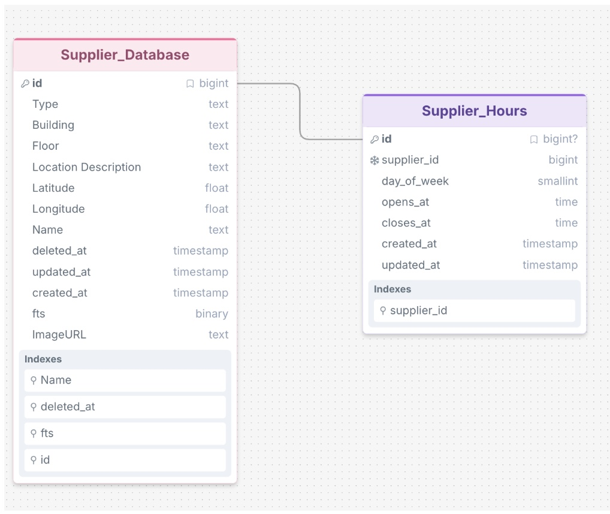

## Database Stack Overview 

----------------------------------------------------------------------------------------------------

- PostgreSQL
- Supabase 
- Testcontainers [Docker] for testing

----------------------------------------------------------------------------------------------------

### Database Schema 

- 2 Tables 
- Foreign key is supplierId and is also specified in drizzle schema opening-hours.ts
- fts is used for vector search with PostgresSql ts vector. It counts a set of letters and matches them to the next most relevant parameter 
[Building Name, Location Description, Name]
If a location description is `This is an ice cream shop` then `ice cream shop` has evaluate the 14 chars against the 25 chars description

### How to run supabase, create a migration, and test migration 

To run supabase safely and without connecting to the production database, please run it locally. 

`npx supabase start` initializes supabase with the migration files and the `seed.sql` file

Before pushing a new migration please execute `npx supabase migration new <migration_name>`

Apply the migration with `npx supabase migration up` to verify that your schema/column changes are applied 

Finally to push to prod `npx supabase link <prod_link>'
Then `npx supabase db push ` 

AND LASTLY: npx supabase unlink

This repo executes test only on the seed.sql data, which is hardcoded test data. IF the seed.sql data changes the tests will also need to change

Find the testcontainers setup that runs lightweight supabase tests in tests/ folder

### How to setup testcontainers for local unit testing

### How to setup a staging environment for production database testing 
